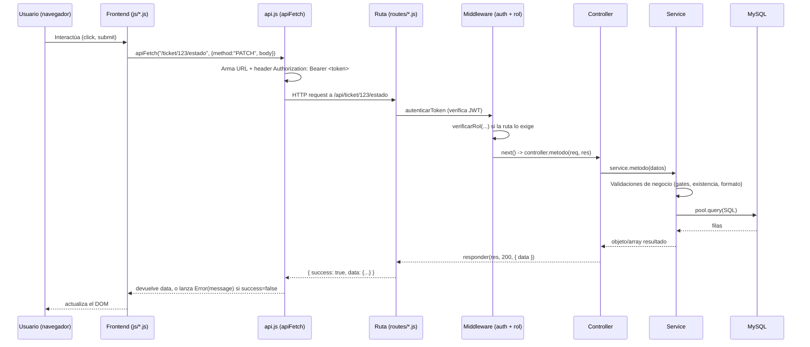
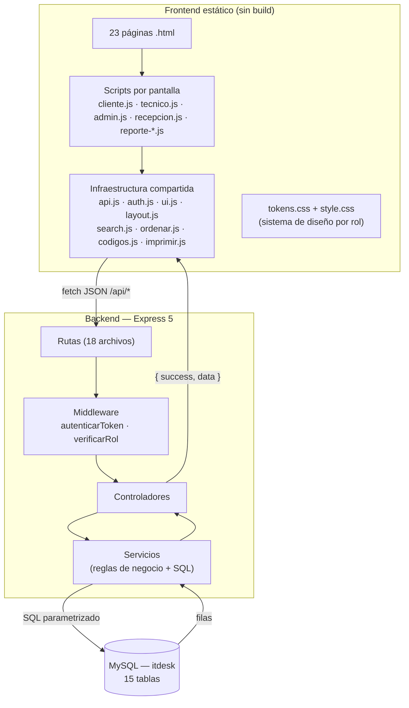

# 3. Arquitectura del sistema

## Visión general

ITDesk separa completamente el frontend del backend: no hay renderizado del lado del servidor. El frontend es un sitio estático (HTML/CSS/JS servido tal cual, sin build) que consume una API REST vía `fetch`. El backend no sabe nada de HTML — solo recibe y devuelve JSON.

```
┌─────────────────────┐        fetch (JSON)        ┌──────────────────────┐        SQL        ┌───────────┐
│   Frontend estático  │ ──────────────────────────▶ │   Backend (Express)   │ ─────────────────▶ │   MySQL   │
│  HTML / CSS / JS      │ ◀────────────────────────── │   /api/...             │ ◀───────────────── │  (itdesk)  │
└─────────────────────┘      { success, data }      └──────────────────────┘      filas/rows    └───────────┘
```

## Flujo de una petición

Toda petición autenticada del frontend al backend recorre el mismo camino, sin excepciones:



Puntos clave de este flujo, verificados contra el código real:

1. **`apiFetch` es el único punto de salida hacia la red** en todo el frontend (`frontend/js/api.js`). Ningún script llama a `fetch` directamente. Agrega el header `Authorization` automáticamente si hay sesión, y si la respuesta no es `success: true`, lanza una excepción con el `message` del backend — cada pantalla solo necesita un `try/catch` alrededor del `apiFetch`, no repetir el manejo del contrato de respuesta.
2. **Todas las rutas protegidas aplican `router.use(autenticarToken)`** al principio del archivo — no hay control de acceso "por endpoint individual" salvo casos puntuales donde el ownership se valida dentro del controller/service (ver [07-autenticacion.md](07-autenticacion.md)).
3. **La lógica de negocio vive en el service, no en el controller.** El controller es delgado: extrae datos del `req`, llama al service, y traduce el resultado (o el error) a una respuesta HTTP con `responder()`. Las validaciones, los cálculos y los *gates* de estado (por ejemplo, "no se puede marcar Resuelto sin cotización aprobada") están siempre en el service.
4. **No hay middleware de manejo de errores global** en `app.js` — cada controller tiene su propio `try/catch` que captura cualquier error lanzado por el service y lo traduce a `responder(res, error.status || 500, { message: error.message })`. Es una limitación real del proyecto, documentada en [14-problemas-conocidos.md](14-problemas-conocidos.md).
5. **La respuesta siempre sigue el mismo contrato**: `{ success: boolean, message?: string, data?: any }`. El frontend depende de esta forma exacta en `apiFetch`.

## Capas del backend

| Capa | Carpeta | Responsabilidad |
|---|---|---|
| Rutas | `backend/src/routes/` | Define método HTTP + URL + qué middleware aplica + qué método del controller se ejecuta. No contiene lógica. |
| Middleware | `backend/src/middleware/` | Autenticación (JWT) y autorización (rol). Se ejecuta antes del controller. |
| Controladores | `backend/src/controllers/` | Extrae datos de `req` (body/params/query/JWT), llama al service, arma la respuesta HTTP. No contiene SQL ni reglas de negocio. |
| Servicios | `backend/src/services/` | Toda la lógica de negocio: validaciones, cálculos, gates de estado, y el acceso a datos (`pool.query`). Es la única capa que habla SQL. |
| Base de datos | `backend/src/config/database.js` + MySQL | Pool de conexiones `mysql2/promise`. Sin ORM — las consultas son SQL crudo parametrizado. |

Esta separación es estricta y consistente en los 18 recursos del sistema — cualquier endpoint nuevo debe seguir el mismo patrón (ver [11-guia-desarrolladores.md](11-guia-desarrolladores.md)).

## Frontend: cómo se arma una pantalla protegida

No hay router de cliente ni SPA. Cada `.html` es una página real, y todas las protegidas comparten el mismo esqueleto:

```html
<body data-protegido="Rol1,Rol2" data-titulo="..." data-footer="...">
  <div class="app-shell">
    <div id="sidebar-placeholder"></div>
    <div class="app-main">
      <div id="topbar-mobile-placeholder"></div>
      <div id="topbar-desktop-placeholder"></div>
      <main class="app-content">...</main>
      <div id="footer-placeholder"></div>
    </div>
  </div>
```

`js/layout.js` (`Layout.init()`, en `DOMContentLoaded`) lee `data-protegido`, exige sesión válida con `Auth.requerirRol(...)` (redirige a `login.html` si no hay sesión o el rol no coincide), y si pasa, rellena los `*-placeholder` con el sidebar/topbar/footer correspondientes al rol de la sesión. Una página sin `data-protegido` (solo `index.html` y `login.html`) no pasa por este control.

Un script inline en el `<head>` de cada página aplica el tema oscuro/claro guardado en `localStorage` antes del primer paint (para evitar parpadeo visual).

## Sin tiempo real

No hay websockets en el proyecto. Las pantallas que necesitan reflejar cambios recientes usan *polling*:
- La campanita de notificaciones (`layout.js`) reconsulta cada 45 segundos.
- Los KPIs de `dashboard-admin.html` (`admin.js`) reconsultan cada 60 segundos.

Es una decisión de arquitectura, no una limitación pendiente de resolver — ver [15-futuras-mejoras.md](15-futuras-mejoras.md) si se quisiera evolucionar a algo push-based.

## Diagrama de arquitectura por capas


