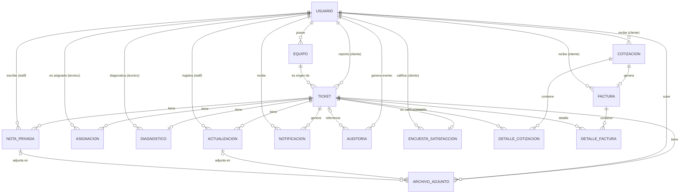

# 5. Base de datos

Motor: MySQL/MariaDB (esquema exportado desde MariaDB 10.4), motor de tabla InnoDB, charset `utf8mb4` / collation `utf8mb4_unicode_ci` en todas las tablas. Definición completa en [`base de datos/schema.sql`](../base%20de%20datos/schema.sql). Sin ORM: el backend ejecuta SQL parametrizado directo vía `mysql2/promise`.

Total: **15 tablas**, sin datos semilla versionados en el repositorio.

## 5.1. Listado de tablas

| Tabla | Columnas | Propósito |
|---|---|---|
| `usuario` | 13 | Tabla raíz de personas del sistema (clientes y staff: Administrador/Tecnico/Cliente/Recepcionista vía `rol`); toda otra tabla que tiene `id_usuario` apunta acá. |
| `equipo` | 9 | Un equipo físico (PC, impresora, etc.) registrado a nombre de un `usuario` (cliente), identificado por número de serie único; origen de los tickets. |
| `ticket` | 11 | El caso de soporte: vincula un `usuario` (cliente que reporta) con un `equipo`, con prioridad/categoría/estado y fechas de apertura, resolución y cierre. Es la entidad central de la que cuelgan casi todas las demás tablas. |
| `actualizacion` | 6 | Historial de cambios de estado de un ticket, registrado por un usuario de staff (bitácora pública del ticket). |
| `asignacion` | 5 | Vincula un ticket con un técnico (`usuario`) responsable, con bandera `activa` para saber cuál asignación rige. |
| `diagnostico` | 7 | Diagnóstico técnico de un ticket (uno por ticket, forzado por `UNIQUE`), escrito por el técnico. |
| `nota_privada` | 5 | Nota interna de staff sobre un ticket, no visible al cliente. |
| `notificacion` | 7 | Notificación dirigida a un usuario (destinatario) sobre eventos de un ticket, con bandera de leída/no leída. |
| `archivo_adjunto` | 11 | Archivo subido en el contexto de un ticket, opcionalmente ligado a una `actualizacion` o a una `nota_privada` puntual, con bandera público/privado. |
| `auditoria` | 6 | Log de auditoría de acciones del sistema, ligado al usuario que las ejecuta y opcionalmente a un ticket. |
| `cotizacion` | 8 | Cotización de servicio dirigida a un cliente (`usuario`), con montos (subtotal/ITBIS/descuento/total) y estado de aprobación. |
| `detalle_cotizacion` | 7 | Línea de detalle (mano de obra/repuestos/descuento) de una cotización, ligada también al ticket que origina el servicio. |
| `factura` | 9 | Factura generada a partir de una cotización aprobada (relación 1 a 1 forzada por `UNIQUE`), dirigida al mismo cliente. |
| `detalle_factura` | 7 | Línea de detalle de una factura, estructuralmente paralela a `detalle_cotizacion`. |
| `encuesta_satisfaccion` | 6 | Calificación (1-5) y comentario opcional que el cliente deja sobre un ticket cerrado (una por ticket, forzado por `UNIQUE`). |

## 5.2. Diagrama entidad-relación

Notas de lectura del diagrama: las relaciones `DIAGNOSTICO`, `ENCUESTA_SATISFACCION` y `FACTURA` usan cardinalidad `o|` (cero-o-uno) porque además de ser FK tienen un `UNIQUE KEY` que fuerza 1:1 con `TICKET`/`COTIZACION`. `ARCHIVO_ADJUNTO` respecto de `ACTUALIZACION`/`NOTA_PRIVADA` y `AUDITORIA` respecto de `TICKET` usan `|o` del lado "uno" porque esas columnas FK son `NULL`-ables (la relación es opcional).

## 5.3. Detalle de cada tabla

### `usuario`
Tabla raíz de personas: clientes y staff, diferenciados por `rol`. Sin FK salientes.

| Columna | Tipo | Nulo | Default | Notas |
|---|---|---|---|---|
| `id_usuario` | `int(11)` | NO | AUTO_INCREMENT | PK |
| `nombre` | `varchar(100)` | NO | | |
| `apellido` | `varchar(100)` | NO | | |
| `correo` | `varchar(150)` | NO | | `UNIQUE` |
| `contraseña` | `varchar(255)` | NO | | hash bcrypt, nunca se devuelve en las respuestas de la API |
| `rol` | `varchar(50)` | NO | | `Administrador` / `Tecnico` / `Cliente` / `Recepcionista` (constante, no `ENUM` en el schema) |
| `tipo_documento` | `varchar(20)` | NO | | |
| `num_documento` | `varchar(50)` | NO | | `UNIQUE` |
| `telefono` | `varchar(20)` | sí | NULL | |
| `direccion` | `varchar(255)` | sí | NULL | |
| `especialidad` | `varchar(100)` | sí | NULL | usado por técnicos |
| `estado` | `varchar(20)` | sí | `'Activo'` | `Activo` / `Inactivo` — funciona como soft-delete |
| `fecha_registro` | `datetime` | sí | `current_timestamp()` | |

FK entrantes (12 tablas apuntan acá): `actualizacion`, `archivo_adjunto`, `asignacion`, `auditoria`, `cotizacion`, `diagnostico`, `encuesta_satisfaccion`, `equipo`, `factura`, `nota_privada`, `notificacion`, `ticket`.

### `equipo`
Equipo físico a nombre de un cliente.

| Columna | Tipo | Nulo | Default | Notas |
|---|---|---|---|---|
| `id_equipo` | `int(11)` | NO | AUTO_INCREMENT | PK |
| `id_usuario` | `int(11)` | NO | | FK → `usuario.id_usuario`, `ON DELETE CASCADE` |
| `tipo` | `varchar(50)` | NO | | |
| `marca` | `varchar(50)` | NO | | |
| `modelo` | `varchar(50)` | NO | | |
| `numero_serie` | `varchar(100)` | NO | | `UNIQUE` (índice duplicado en el schema, ver 5.5) |
| `estado` | `varchar(50)` | NO | `'Activo'` | texto libre, sin validación de valores en el backend |
| `fecha_registro` | `datetime` | NO | `current_timestamp()` | |
| `observaciones` | `text` | sí | NULL | |

FK entrante: `ticket.id_equipo`.

### `ticket`
Entidad central del sistema.

| Columna | Tipo | Nulo | Default | Notas |
|---|---|---|---|---|
| `id_ticket` | `int(11)` | NO | AUTO_INCREMENT | PK |
| `id_usuario` | `int(11)` | NO | | FK → `usuario.id_usuario` (cliente que reporta) |
| `id_equipo` | `int(11)` | NO | | FK → `equipo.id_equipo` |
| `titulo` | `varchar(150)` | NO | | |
| `descripcion` | `text` | NO | | |
| `prioridad` | `varchar(20)` | NO | | texto libre — el frontend usa `Alta`/`Media`/`Baja` mas no hay constante de backend |
| `categoria` | `varchar(20)` | NO | `'Otro'` | `Hardware` / `Software` / `Red` / `Otro` |
| `estado` | `varchar(20)` | sí | `'Abierto'` | `Abierto` / `En proceso` / `Resuelto` / `Cerrado` |
| `fecha_apertura` | `datetime` | sí | `current_timestamp()` | |
| `fecha_resolucion` | `datetime` | sí | NULL | se limpia a NULL si el ticket vuelve a "En proceso" |
| `fecha_cierre` | `datetime` | sí | NULL | solo la setea `PATCH /ticket/:id/cerrar` |

No existe una columna de "última modificación" — ver la nota de la sección 5.5.

FK entrantes (10 tablas): `actualizacion`, `archivo_adjunto`, `asignacion`, `auditoria` (opcional), `detalle_cotizacion`, `detalle_factura`, `diagnostico`, `encuesta_satisfaccion`, `nota_privada`, `notificacion`.

### `actualizacion`
Bitácora pública de cambios de estado, registrada por staff.

| Columna | Tipo | Nulo | Default | Notas |
|---|---|---|---|---|
| `id_actualizacion` | `int(11)` | NO | AUTO_INCREMENT | PK |
| `id_ticket` | `int(11)` | NO | | FK → `ticket.id_ticket`, `ON DELETE CASCADE` |
| `id_usuario` | `int(11)` | NO | | FK → `usuario.id_usuario` (debe ser staff) |
| `estado` | `varchar(20)` | NO | | |
| `observaciones` | `text` | sí | NULL | si es NULL, el cliente no ve esta entrada |
| `fecha_actualizacion` | `datetime` | sí | `current_timestamp()` | |

FK entrante: `archivo_adjunto.id_actualizacion` (opcional).

### `asignacion`
Vincula un ticket con un técnico "sugerido".

| Columna | Tipo | Nulo | Default | Notas |
|---|---|---|---|---|
| `id_asignacion` | `int(11)` | NO | AUTO_INCREMENT | PK |
| `id_ticket` | `int(11)` | NO | | FK → `ticket.id_ticket`, `ON DELETE CASCADE` |
| `id_usuario` | `int(11)` | NO | | FK → `usuario.id_usuario` (el técnico) |
| `fecha_asignacion` | `datetime` | sí | `current_timestamp()` | |
| `activa` | `tinyint(1)` | sí | `1` | sin `UNIQUE` — "una sola activa por ticket" es regla de aplicación, no de schema |

Sin FK entrantes.

### `diagnostico`
Diagnóstico técnico, uno por ticket.

| Columna | Tipo | Nulo | Default | Notas |
|---|---|---|---|---|
| `id_diagnostico` | `int(11)` | NO | AUTO_INCREMENT | PK |
| `id_ticket` | `int(11)` | NO | | FK → `ticket.id_ticket`, `ON DELETE CASCADE`, `UNIQUE` (fuerza 1:1) |
| `id_usuario` | `int(11)` | NO | | FK → `usuario.id_usuario` (el técnico) |
| `diagnostico` | `text` | NO | | |
| `solucion` | `text` | sí | NULL | |
| `observaciones` | `text` | sí | NULL | |
| `fecha_diagnostico` | `datetime` | sí | `current_timestamp()` | |

Sin FK entrantes.

### `nota_privada`
Nota interna, no visible al cliente.

| Columna | Tipo | Nulo | Default | Notas |
|---|---|---|---|---|
| `id_nota` | `int(11)` | NO | AUTO_INCREMENT | PK |
| `id_ticket` | `int(11)` | NO | | FK → `ticket.id_ticket`, `ON DELETE CASCADE` |
| `id_usuario` | `int(11)` | NO | | FK → `usuario.id_usuario` (staff autor) |
| `contenido` | `text` | NO | | |
| `fecha_creacion` | `datetime` | sí | `current_timestamp()` | |

FK entrante: `archivo_adjunto.id_nota_privada` (opcional).

### `notificacion`
Notificación dirigida a un usuario.

| Columna | Tipo | Nulo | Default | Notas |
|---|---|---|---|---|
| `id_notificacion` | `int(11)` | NO | AUTO_INCREMENT | PK |
| `id_ticket` | `int(11)` | NO | | FK → `ticket.id_ticket`, `ON DELETE CASCADE` |
| `id_usuario` | `int(11)` | NO | | FK → `usuario.id_usuario`, `ON DELETE CASCADE` (destinatario, cualquier rol) |
| `tipo` | `varchar(50)` | NO | | texto libre, máx. 50 caracteres validado en el service |
| `mensaje` | `text` | NO | | |
| `leida` | `tinyint(1)` | sí | `0` | |
| `fecha_envio` | `datetime` | sí | `current_timestamp()` | |

Sin FK entrantes. Nunca se crea automáticamente como efecto secundario de otro evento — siempre nace de un `POST /api/notificacion` explícito (ver [06-api.md](06-api.md)).

### `archivo_adjunto`
Archivo subido en contexto de un ticket.

| Columna | Tipo | Nulo | Default | Notas |
|---|---|---|---|---|
| `id_archivo` | `int(11)` | NO | AUTO_INCREMENT | PK |
| `id_ticket` | `int(11)` | NO | | FK → `ticket.id_ticket`, `ON DELETE CASCADE` |
| `id_usuario` | `int(11)` | NO | | FK → `usuario.id_usuario`, `ON DELETE CASCADE` (quien sube) |
| `nombre_original` | `varchar(255)` | NO | | nombre tal cual lo subió el usuario |
| `nombre_archivo` | `varchar(255)` | NO | | nombre físico generado (timestamp + random), evita colisiones/path traversal |
| `tipo_mime` | `varchar(100)` | NO | | |
| `tamano_bytes` | `int(11)` | NO | | límite de 5 MB aplicado por `multer` |
| `publico` | `tinyint(1)` | NO | `0` | si es visible para el cliente dueño del ticket |
| `id_actualizacion` | `int(11)` | sí | NULL | FK → `actualizacion.id_actualizacion`, `ON DELETE SET NULL` |
| `id_nota_privada` | `int(11)` | sí | NULL | FK → `nota_privada.id_nota`, `ON DELETE SET NULL` |
| `fecha_subida` | `datetime` | sí | `current_timestamp()` | |

Sin FK entrantes. El schema no impide que `id_actualizacion` e `id_nota_privada` estén poblados a la vez; cuál combinación ocurre en la práctica depende de la lógica de la aplicación.

### `auditoria`
Log de acciones del sistema.

| Columna | Tipo | Nulo | Default | Notas |
|---|---|---|---|---|
| `id_auditoria` | `int(11)` | NO | AUTO_INCREMENT | PK |
| `id_usuario` | `int(11)` | NO | | FK → `usuario.id_usuario` |
| `accion` | `varchar(50)` | NO | | código de evento, ej. `TICKET_CREADO` |
| `descripcion` | `text` | NO | | mensaje legible |
| `id_ticket` | `int(11)` | sí | NULL | FK → `ticket.id_ticket`, `ON DELETE SET NULL` (opcional, hay eventos sin ticket) |
| `fecha` | `datetime` | sí | `current_timestamp()` | |

Sin FK entrantes. Sin `POST` público — solo se escribe internamente desde otros servicios (ver [06-api.md](06-api.md), recurso `auditoria`).

### `cotizacion`
Cotización dirigida a un cliente.

| Columna | Tipo | Nulo | Default | Notas |
|---|---|---|---|---|
| `id_cotizacion` | `int(11)` | NO | AUTO_INCREMENT | PK |
| `id_usuario` | `int(11)` | NO | | FK → `usuario.id_usuario` (cliente destinatario) |
| `fecha_creacion` | `datetime` | sí | `current_timestamp()` | |
| `subtotal` | `decimal(10,2)` | NO | `0.00` | calculado a partir de `detalle_cotizacion` |
| `itbis` | `decimal(10,2)` | NO | `0.00` | |
| `descuento_total` | `decimal(10,2)` | sí | `0.00` | descuento global, editable solo si `estado = Pendiente` |
| `total` | `decimal(10,2)` | NO | `0.00` | |
| `estado` | `varchar(20)` | sí | `'Pendiente'` | `Pendiente` / `Aprobada` / `Rechazada` / `Vencida` |

FK entrantes: `detalle_cotizacion.id_cotizacion`, `factura.id_cotizacion`.

### `detalle_cotizacion`
Línea de una cotización.

| Columna | Tipo | Nulo | Default | Notas |
|---|---|---|---|---|
| `id_detalle_cotizacion` | `int(11)` | NO | AUTO_INCREMENT | PK |
| `id_cotizacion` | `int(11)` | NO | | FK → `cotizacion.id_cotizacion`, `ON DELETE CASCADE` |
| `id_ticket` | `int(11)` | NO | | FK → `ticket.id_ticket`, `ON DELETE CASCADE` |
| `descripcion_servicio` | `text` | NO | | |
| `mano_obra` | `decimal(10,2)` | sí | `0.00` | |
| `repuestos` | `decimal(10,2)` | sí | `0.00` | |
| `descuento` | `decimal(10,2)` | sí | `0.00` | |

Sin FK entrantes.

### `factura`
Factura generada desde una cotización aprobada (snapshot).

| Columna | Tipo | Nulo | Default | Notas |
|---|---|---|---|---|
| `id_factura` | `int(11)` | NO | AUTO_INCREMENT | PK |
| `id_cotizacion` | `int(11)` | NO | | FK → `cotizacion.id_cotizacion`, `UNIQUE` (fuerza 1:1) |
| `id_usuario` | `int(11)` | NO | | FK → `usuario.id_usuario` (mismo cliente que la cotización) |
| `fecha_emision` | `datetime` | sí | `current_timestamp()` | |
| `subtotal` | `decimal(10,2)` | NO | `0.00` | copiado de la cotización al momento de facturar |
| `itbis` | `decimal(10,2)` | NO | `0.00` | |
| `total` | `decimal(10,2)` | NO | `0.00` | |
| `estado` | `varchar(20)` | sí | `'Pendiente'` | `Pendiente` / `Pagada` / `Anulada` / `Vencida` |
| `observaciones` | `text` | sí | NULL | editable en cualquier estado |

FK entrante: `detalle_factura.id_factura`.

### `detalle_factura`
Línea de una factura, paralela a `detalle_cotizacion`.

| Columna | Tipo | Nulo | Default | Notas |
|---|---|---|---|---|
| `id_detalle_factura` | `int(11)` | NO | AUTO_INCREMENT | PK |
| `id_factura` | `int(11)` | NO | | FK → `factura.id_factura`, `ON DELETE CASCADE` |
| `id_ticket` | `int(11)` | NO | | FK → `ticket.id_ticket` (sin `ON DELETE`, a diferencia de `detalle_cotizacion.id_ticket`) |
| `descripcion_servicio` | `text` | NO | | |
| `mano_obra` | `decimal(10,2)` | sí | `0.00` | |
| `repuestos` | `decimal(10,2)` | sí | `0.00` | |
| `descuento` | `decimal(10,2)` | sí | `0.00` | |

Sin FK entrantes. Solo lectura — las líneas nacen y mueren junto con la factura, no hay endpoint para editarlas por separado.

### `encuesta_satisfaccion`
Calificación del cliente sobre un ticket cerrado.

| Columna | Tipo | Nulo | Default | Notas |
|---|---|---|---|---|
| `id_encuesta` | `int(11)` | NO | AUTO_INCREMENT | PK |
| `id_ticket` | `int(11)` | NO | | FK → `ticket.id_ticket`, `ON DELETE CASCADE`, `UNIQUE` (fuerza 1:1) |
| `id_usuario` | `int(11)` | NO | | FK → `usuario.id_usuario` (debe ser el dueño del ticket) |
| `calificacion` | `tinyint(1)` | NO | | entero 1-5, sin `CHECK` de rango en el schema |
| `comentario` | `text` | sí | NULL | |
| `fecha` | `datetime` | sí | `current_timestamp()` | |

Sin FK entrantes. Sin endpoint de edición — una vez enviada, la calificación queda fija.

## 5.4. Convenciones del esquema

- **Tablas en singular y `snake_case`**: `ticket`, `usuario`, `nota_privada`, `archivo_adjunto`, etc. Ninguna tabla está en plural.
- **PK con prefijo `id_<tabla>`** en las 15 tablas, salvo dos casos irregulares: `nota_privada` usa `id_nota` (no `id_nota_privada`), y las columnas FK se llaman igual que la PK que referencian en todos los casos (`id_usuario`, `id_ticket`, etc.).
- **Fechas siempre `DATETIME`** con `DEFAULT current_timestamp()`, nunca `TIMESTAMP`, y ninguna con `ON UPDATE CURRENT_TIMESTAMP` (no se auto-actualizan al modificar la fila).
- **Booleanos como `tinyint(1)`**: `archivo_adjunto.publico`, `asignacion.activa`, `notificacion.leida`.
- **Dinero como `DECIMAL(10,2)`**, nunca `FLOAT`/`DOUBLE`: todos los montos de `cotizacion`, `detalle_cotizacion`, `factura`, `detalle_factura`.
- **Estados como texto libre (`varchar`), no `ENUM`**: la base de datos no impide un valor de `estado` inválido — la validación vive en `backend/src/constants/*.js` y se aplica en la capa de servicio, no en el schema.
- **Patrón "snapshot" en facturación**: `factura`/`detalle_factura` copian los montos y líneas de la cotización aprobada al momento de facturar; no se recalculan en vivo si `detalle_cotizacion` cambiara después (aunque en la práctica ya no puede cambiar, por la regla de "cotización bloqueada fuera de Pendiente").
- **FK + `UNIQUE` para modelar 1:1** sobre columnas que estructuralmente son FK 1:N: `diagnostico.id_ticket`, `encuesta_satisfaccion.id_ticket`, `factura.id_cotizacion`.

## 5.5. Particularidades a tener en cuenta

- **No existe una columna de "última modificación" en `ticket`.** Solo hay `fecha_apertura`, `fecha_resolucion` y `fecha_cierre`. La tabla `actualizacion` guarda un historial de cambios con su propia fecha por fila, pero no es equivalente a un campo "última modificación del ticket" — cualquier funcionalidad que necesite eso (por ejemplo, un filtro de "actualizado entre estas fechas") requeriría agregar una columna nueva y escribirla en cada endpoint que muta un ticket.
- **`ON DELETE` inconsistente en las FK hacia `usuario`.** La mayoría no especifican `ON DELETE` (comportamiento por defecto de InnoDB: `RESTRICT`) — así están `actualizacion`, `asignacion`, `auditoria`, `cotizacion`, `diagnostico`, `encuesta_satisfaccion`, `factura`, `nota_privada`, `ticket`. Mientras que `equipo.id_usuario`, `archivo_adjunto.id_usuario` y `notificacion.id_usuario` sí usan `ON DELETE CASCADE`. El schema no documenta el criterio. En la práctica, como `usuario.estado` funciona como soft-delete, el `DELETE` físico de un usuario rara vez se ejecuta desde la aplicación (y de hecho `DELETE /api/usuarios/:id` está marcado en el propio código como "no usar", ver [14-problemas-conocidos.md](14-problemas-conocidos.md)) — pero eso no está garantizado por el schema.
- **Asimetría `detalle_cotizacion.id_ticket` vs `detalle_factura.id_ticket`**: la primera tiene `ON DELETE CASCADE`, la segunda no (`RESTRICT` por default), pese a ser estructuralmente paralelas.
- **`UNIQUE KEY` duplicada en `equipo`**: existen dos índices únicos sobre `numero_serie` (`UQ_Equipo_Serie` y uno autogenerado). Redundante, no afecta la integridad, pero es ruido en el schema.
- **`equipo.estado`** tiene el mismo patrón de nombre/default que `usuario.estado` (sugiere soft-delete), pero `backend/src/constants/estadosEquipo.js` está vacío a propósito — el campo no tiene valores validados ni usados activamente en el backend, es texto libre real.
- **`ticket.prioridad` no tiene constante de backend equivalente a `categoria`/`estado`.** Su conjunto de valores válidos (`Alta`/`Media`/`Baja`) existe únicamente por convención del frontend, no está validado ni documentado en el backend.
- **`asignacion.activa`** no tiene ningún `UNIQUE`/`CHECK` a nivel de base de datos que garantice una sola asignación activa por ticket — es responsabilidad exclusiva de la capa de servicio (`POST /api/asignacion` rechaza con 409 si ya existe una activa).
