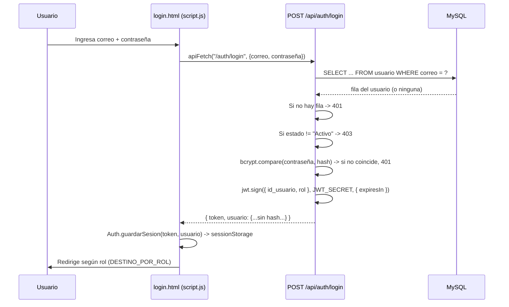

# 7. Sistema de autenticación

## Resumen

ITDesk usa **JWT stateless** — no hay sesiones en la base de datos, ni endpoint de logout (invalidar un token del lado del servidor no existe; "cerrar sesión" es simplemente borrar el token del lado del cliente), ni refresh token. El token se firma con un secreto compartido (`JWT_SECRET`) y expira según `JWT_EXPIRES_IN` (`8h` en el entorno de desarrollo).

## Flujo de login



Ver el detalle completo de mensajes de error y status codes en [api/auth.md](api/auth.md).

## Forma exacta del JWT

El payload firmado contiene **únicamente**:

```json
{
  "id_usuario": 4,
  "rol": "Tecnico",
  "iat": 1785600000,
  "exp": 1785628800
}
```

No lleva nombre, correo, ni ningún otro dato — cualquier pantalla que necesite mostrar el nombre del usuario en sesión lo obtiene del objeto `usuario` que se guarda aparte en `sessionStorage` al hacer login (`Auth.getUsuario()`), no del token.

## Middleware del backend

### `autenticarToken` (`backend/src/middleware/auth.middleware.js`)

Se aplica con `router.use(autenticarToken)` al principio de **16 de los 18** archivos de rutas (todos salvo `health.routes.js` y `estadisticas.routes.js`). Flujo:

1. Lee el header `Authorization`. Si falta → error 401.
2. Exige el formato exacto `"Bearer <token>"`. Si no matchea → error 401.
3. Verifica la firma y expiración con `jwt.verify(token, JWT_SECRET)`.
4. Si es válido, asigna `req.usuario = payload` (el objeto `{ id_usuario, rol, iat, exp }`) y continúa.

> Nota de implementación: todo el flujo está envuelto en un único `try/catch`, así que **cualquiera** de los fallos anteriores (token ausente, formato inválido, firma inválida, token expirado) termina respondiendo el mismo mensaje genérico `"Token inválido o expirado"` con status `401` — los mensajes más específicos que arma el código internamente nunca llegan al cliente. Es un detalle a tener en cuenta si se necesita diferenciar "no hay token" de "token vencido" en la interfaz.

### `verificarRol(...rolesPermitidos)` (`backend/src/middleware/rol.middleware.js`)

Una *factory*: se usa como `verificarRol(ROLES.ADMINISTRADOR, ROLES.TECNICO)` en la definición de cada ruta que lo necesite. Compara `req.usuario.rol` (ya puesto ahí por `autenticarToken`) contra la lista de roles permitida — si no está, responde `403 "No tienes permisos para realizar esta accion."`. Siempre se usa **después** de `autenticarToken`; si se usara antes, fallaría porque `req.usuario` no existiría todavía.

### Patrón estándar en cada archivo de rutas

```js
router.use(autenticarToken);                                    // toda ruta de este archivo exige sesión
router.post("/", verificarRol(ROLES.ADMINISTRADOR, ROLES.TECNICO), controller.crear);
router.get("/:id", verificarRol(ROLES.ADMINISTRADOR, ROLES.TECNICO), controller.obtenerPorId);
```

Algunos endpoints (por ejemplo `PATCH /api/usuarios/:id/perfil`, o `GET /api/archivos/:id/descargar`) **no usan `verificarRol`** en la ruta — solo exigen sesión válida, y el control de acceso real (ownership: "¿es tu propio recurso?") vive dentro del controller o del service. Ver el detalle endpoint por endpoint en [06-api.md](06-api.md) y `docs/api/*.md`.

## Protección de rutas en el frontend

`frontend/js/auth.js` expone el objeto `Auth`, que maneja la sesión en **`sessionStorage`** (deliberadamente, no `localStorage` — permite tener una sesión distinta por pestaña del navegador):

- `guardarSesion(token, usuario)` / `getToken()` / `getUsuario()` / `getRol()` / `estaAutenticado()`
- `logout()` — limpia la sesión y redirige a `login.html`.
- `cerrarPorSesionVencida()` — deja `motivoLogout=expirada` en `sessionStorage` antes de deslogear; `login.html` lee ese valor para mostrar un aviso.
- `requerirRol(...rolesPermitidos)` — usado por `Layout.init()` (`frontend/js/layout.js`) en cada página protegida: exige sesión y, si la página declaró `data-protegido="Rol1,Rol2"`, que el rol actual esté en esa lista. Si falla, redirige a login con `motivoLogout=sin-permiso`.

`frontend/js/api.js` (`apiFetch`) agrega automáticamente el header `Authorization: Bearer <token>` en cada petición si hay sesión guardada. **Manejo global de expiración**: si cualquier petición (fuera de `/auth/login`) responde `401`, `apiFetch` dispara `Auth.cerrarPorSesionVencida()` automáticamente — ninguna pantalla individual necesita detectar el 401 a mano.

## Las 2 únicas rutas sin autenticación en todo el sistema

| Ruta | Por qué |
|---|---|
| `POST /api/auth/login` | Es el endpoint que emite el token — no puede exigir uno. |
| `GET /api/estadisticas/publicas` | Alimenta `index.html`, la única pantalla sin sesión del sistema; expone solo 4 conteos agregados, nunca una fila individual. |

Todas las demás 97 rutas exigen un JWT válido como mínimo.
