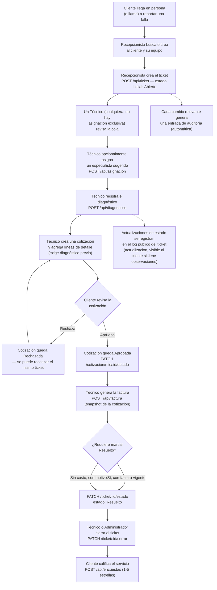
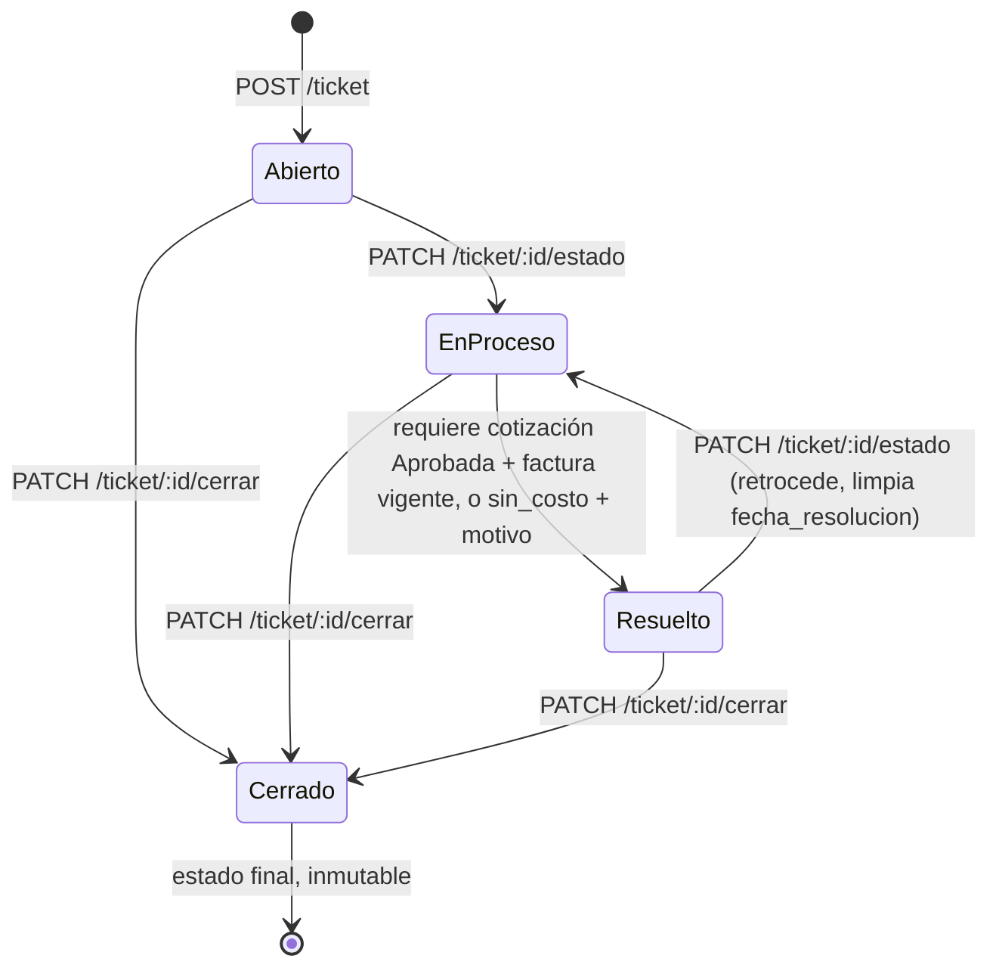
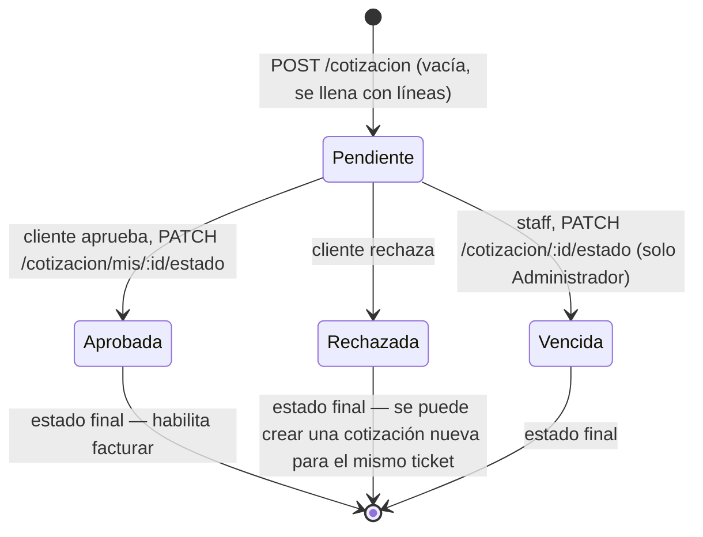
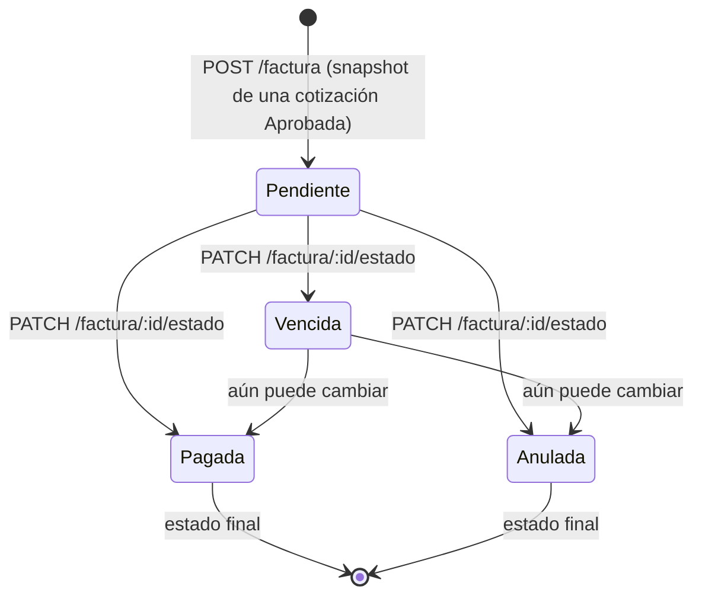

# 9. Flujo del sistema

## Recorrido típico de un ticket

Un caso completo, desde que el cliente llega al mostrador hasta que califica el servicio, involucra a los 4 roles en distintos momentos:

### Notas sobre el diagrama

- El camino "feliz" (diagnóstico → cotización → aprobación → factura → resuelto → cerrado → calificación) es el más común, pero **no es obligatorio en ese orden estricto en todos los puntos**: un ticket puede cerrarse directamente desde "Abierto" (`PATCH /ticket/:id/cerrar` no exige un estado previo), y puede marcarse "Resuelto sin costo" saltándose por completo el circuito de cotización/factura, siempre que se declare un motivo explícito.
- **El único gate de negocio duro en todo este flujo** es que un ticket no puede pasar a `Resuelto` sin una cotización `Aprobada` con factura vigente — o la excepción explícita "sin costo". Ver [api/ticket.md](api/ticket.md).
- La aprobación/rechazo de la cotización es **siempre decisión del cliente** (o de un Administrador actuando en su nombre) — nunca del técnico que hizo el diagnóstico. Ver [api/cotizacion.md](api/cotizacion.md).
- Una cotización rechazada no bloquea el ticket: se puede volver a cotizar (regla "una sola línea de cotización activa por ticket", pero `Rechazada`/`Vencida` no cuentan como activas).

## Ciclo de vida del ticket (estados)

`Cerrado` es un estado terminal real: ni `cambiarEstadoTicket` ni `cerrarTicket` permiten ninguna transición posterior (ambos responden `409`).

## Ciclo de vida de una cotización

Una vez que una cotización sale de `Pendiente`, **queda fija para siempre** — no existe forma de "reabrirla"; la única salida es crear una cotización nueva.

## Ciclo de vida de una factura

`Vencida`, a diferencia de en `cotizacion`, **no es un estado terminal** en `factura` — puede seguir cambiando a `Pagada` o `Anulada`.

## Trazabilidad: qué queda registrado en cada paso

| Evento del flujo | Dónde queda |
|---|---|
| Casi cualquier acción relevante (crear ticket, cerrar, asignar, aprobar cotización, cambiar factura, eliminar archivo, calificar) | `auditoria` — automático, fire-and-forget, nunca bloquea la acción principal |
| Cambios de estado del ticket con comentario | `actualizacion` — log público, visible al cliente si tiene `observaciones` |
| Comentarios internos del staff | `nota_privada` — nunca visible al cliente |
| Avisos puntuales a un usuario | `notificacion` — nunca automático, siempre creado explícitamente por staff |

Ver el detalle de cada tabla en [05-base-de-datos.md](05-base-de-datos.md) y de cada endpoint en [06-api.md](06-api.md).
